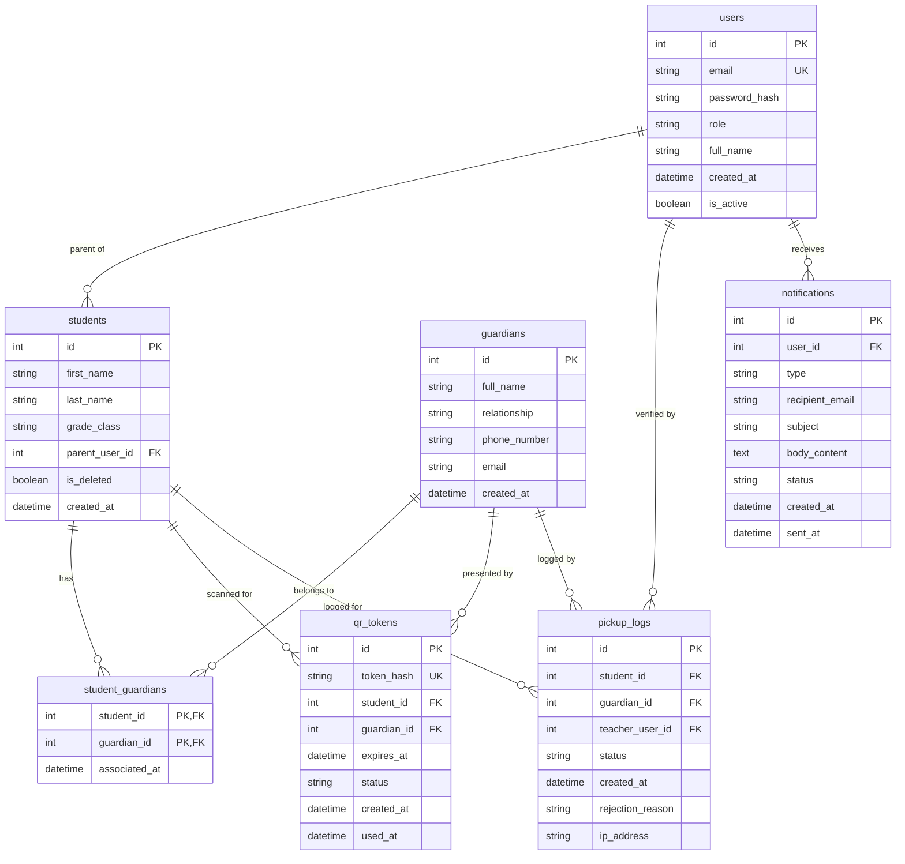

# Backend Schema Document
## Project Name: FirstCry Intelliots Portal

This document outlines the complete relational database design for the FirstCry Intelliots Portal, built on MySQL 8.0.

---

## 1. Entity-Relationship (ER) Diagram
The diagram below details table relationships, foreign keys, and cardinalities.



---

## 2. Table & Schema Definitions

### 2.1 Table: `users`
Stores user profile credentials, hashes, and access roles.
*   **Indices:**
    *   `idx_users_email` (UNIQUE): On `email` for rapid authentication query checks.

| Column Name | Data Type | Constraints | Description |
| :--- | :--- | :--- | :--- |
| `id` | `INT` | Primary Key, Auto-Increment | Unique user identifier. |
| `email` | `VARCHAR(191)` | Unique, Not Null | Primary login email. |
| `password_hash` | `VARCHAR(255)` | Not Null | Hashed password (using bcrypt). |
| `role` | `ENUM('Parent', 'Teacher', 'Admin')` | Not Null | Role defining permissions. |
| `full_name` | `VARCHAR(100)` | Not Null | Full legal name of user. |
| `created_at` | `DATETIME` | Default CURRENT_TIMESTAMP | Date user registered. |
| `is_active` | `BOOLEAN` | Default True | Access control flag. |

```sql
CREATE TABLE users (
    id INT AUTO_INCREMENT PRIMARY KEY,
    email VARCHAR(191) NOT NULL UNIQUE,
    password_hash VARCHAR(255) NOT NULL,
    role ENUM('Parent', 'Teacher', 'Admin') NOT NULL,
    full_name VARCHAR(100) NOT NULL,
    created_at DATETIME DEFAULT CURRENT_TIMESTAMP,
    is_active BOOLEAN DEFAULT TRUE,
    INDEX idx_users_email (email)
) ENGINE=InnoDB DEFAULT CHARSET=utf8mb4 COLLATE=utf8mb4_unicode_ci;
```

---

### 2.2 Table: `students`
Defines student records bound to their primary Parent user account.
*   **Indices:**
    *   `idx_students_parent` (INDEX): On `parent_user_id` to retrieve child lists.
    *   `idx_students_name` (INDEX): On `last_name, first_name` for search auto-completion.

| Column Name | Data Type | Constraints | Description |
| :--- | :--- | :--- | :--- |
| `id` | `INT` | Primary Key, Auto-Increment | Unique student ID. |
| `first_name` | `VARCHAR(50)` | Not Null | Given name. |
| `last_name` | `VARCHAR(50)` | Not Null | Family name. |
| `grade_class` | `VARCHAR(30)` | Not Null | Current classroom assignment (e.g. "K-A"). |
| `parent_user_id` | `INT` | Foreign Key (users.id), Not Null | Identifies primary parent account. |
| `is_deleted` | `BOOLEAN` | Default False | Soft delete flag to preserve history. |
| `created_at` | `DATETIME` | Default CURRENT_TIMESTAMP | Date student registered. |

```sql
CREATE TABLE students (
    id INT AUTO_INCREMENT PRIMARY KEY,
    first_name VARCHAR(50) NOT NULL,
    last_name VARCHAR(50) NOT NULL,
    grade_class VARCHAR(30) NOT NULL,
    parent_user_id INT NOT NULL,
    is_deleted BOOLEAN DEFAULT FALSE,
    created_at DATETIME DEFAULT CURRENT_TIMESTAMP,
    FOREIGN KEY (parent_user_id) REFERENCES users(id) ON DELETE RESTRICT,
    INDEX idx_students_parent (parent_user_id),
    INDEX idx_students_name (last_name, first_name)
) ENGINE=InnoDB DEFAULT CHARSET=utf8mb4 COLLATE=utf8mb4_unicode_ci;
```

---

### 2.3 Table: `guardians`
Stores contact data of third-party guardians authorized by parents.
*   **Indices:**
    *   `idx_guardians_phone` (INDEX): On `phone_number` for lookup searches.

| Column Name | Data Type | Constraints | Description |
| :--- | :--- | :--- | :--- |
| `id` | `INT` | Primary Key, Auto-Increment | Unique guardian identifier. |
| `full_name` | `VARCHAR(100)` | Not Null | Legal name of guardian. |
| `relationship` | `VARCHAR(50)` | Not Null | Relationship (e.g., Uncle, Nanny). |
| `phone_number` | `VARCHAR(20)` | Not Null | Mobile number for safety check verification. |
| `email` | `VARCHAR(191)` | Not Null | Email address. |
| `created_at` | `DATETIME` | Default CURRENT_TIMESTAMP | Registration date. |

```sql
CREATE TABLE guardians (
    id INT AUTO_INCREMENT PRIMARY KEY,
    full_name VARCHAR(100) NOT NULL,
    relationship VARCHAR(50) NOT NULL,
    phone_number VARCHAR(20) NOT NULL,
    email VARCHAR(191) NOT NULL,
    created_at DATETIME DEFAULT CURRENT_TIMESTAMP
) ENGINE=InnoDB DEFAULT CHARSET=utf8mb4 COLLATE=utf8mb4_unicode_ci;
```

---

### 2.4 Table: `student_guardians`
Bridge table establishing N-to-M mappings between students and authorized guardians.

| Column Name | Data Type | Constraints | Description |
| :--- | :--- | :--- | :--- |
| `student_id` | `INT` | PK, FK (students.id) | Student identifier. |
| `guardian_id` | `INT` | PK, FK (guardians.id) | Guardian identifier. |
| `associated_at` | `DATETIME` | Default CURRENT_TIMESTAMP | Date authorization was granted. |

```sql
CREATE TABLE student_guardians (
    student_id INT NOT NULL,
    guardian_id INT NOT NULL,
    associated_at DATETIME DEFAULT CURRENT_TIMESTAMP,
    PRIMARY KEY (student_id, guardian_id),
    FOREIGN KEY (student_id) REFERENCES students(id) ON DELETE CASCADE,
    FOREIGN KEY (guardian_id) REFERENCES guardians(id) ON DELETE CASCADE
) ENGINE=InnoDB DEFAULT CHARSET=utf8mb4;
```

---

### 2.5 Table: `qr_tokens`
Stores generated dynamic QR tokens.
*   **Indices:**
    *   `idx_tokens_hash` (UNIQUE): On `token_hash` for decryption validation.
    *   `idx_tokens_expiration` (INDEX): On `expires_at` for background expiry checks.

| Column Name | Data Type | Constraints | Description |
| :--- | :--- | :--- | :--- |
| `id` | `INT` | Primary Key, Auto-Increment | Unique token primary identifier. |
| `token_hash` | `VARCHAR(255)` | Unique, Not Null | Secure cryptographically signed token string. |
| `student_id` | `INT` | Foreign Key (students.id), Not Null | Target student. |
| `guardian_id` | `INT` | Foreign Key (guardians.id), Not Null | Authorized presenter. |
| `expires_at` | `DATETIME` | Not Null | Token expiration timestamp. |
| `status` | `ENUM('Active', 'Used', 'Expired')` | Default 'Active' | Token lifecycle status. |
| `created_at` | `DATETIME` | Default CURRENT_TIMESTAMP | Token generation date. |
| `used_at` | `DATETIME` | Nullable | Timestamp of verification. |

```sql
CREATE TABLE qr_tokens (
    id INT AUTO_INCREMENT PRIMARY KEY,
    token_hash VARCHAR(255) NOT NULL UNIQUE,
    student_id INT NOT NULL,
    guardian_id INT NOT NULL,
    expires_at DATETIME NOT NULL,
    status ENUM('Active', 'Used', 'Expired') DEFAULT 'Active',
    created_at DATETIME DEFAULT CURRENT_TIMESTAMP,
    used_at DATETIME NULL,
    FOREIGN KEY (student_id) REFERENCES students(id) ON DELETE RESTRICT,
    FOREIGN KEY (guardian_id) REFERENCES guardians(id) ON DELETE RESTRICT,
    INDEX idx_tokens_hash (token_hash),
    INDEX idx_tokens_expiration (expires_at)
) ENGINE=InnoDB DEFAULT CHARSET=utf8mb4 COLLATE=utf8mb4_unicode_ci;
```

---

### 2.6 Table: `pickup_logs`
Centralized, immutable audit logs tracking verification history.
*   **Indices:**
    *   `idx_pickups_student` (INDEX): For child history lookups.
    *   `idx_pickups_created` (INDEX): For dashboard and reporting filters.

| Column Name | Data Type | Constraints | Description |
| :--- | :--- | :--- | :--- |
| `id` | `INT` | Primary Key, Auto-Increment | Log primary identifier. |
| `student_id` | `INT` | Foreign Key (students.id), Not Null | Associated student. |
| `guardian_id` | `INT` | Foreign Key (guardians.id), Not Null | Associated guardian. |
| `teacher_user_id` | `INT` | Foreign Key (users.id), Not Null | Teacher who scanned the QR. |
| `status` | `ENUM('APPROVED', 'REJECTED')` | Not Null | Audit outcome. |
| `created_at` | `DATETIME` | Default CURRENT_TIMESTAMP | Scan and verification timestamp. |
| `rejection_reason` | `VARCHAR(255)` | Nullable | Detail on fail parameters. |
| `ip_address` | `VARCHAR(45)` | Not Null | Scanner client IP address. |

```sql
CREATE TABLE pickup_logs (
    id INT AUTO_INCREMENT PRIMARY KEY,
    student_id INT NOT NULL,
    guardian_id INT NOT NULL,
    teacher_user_id INT NOT NULL,
    status ENUM('APPROVED', 'REJECTED') NOT NULL,
    created_at DATETIME DEFAULT CURRENT_TIMESTAMP,
    rejection_reason VARCHAR(255) NULL,
    ip_address VARCHAR(45) NOT NULL,
    FOREIGN KEY (student_id) REFERENCES students(id) ON DELETE RESTRICT,
    FOREIGN KEY (guardian_id) REFERENCES guardians(id) ON DELETE RESTRICT,
    FOREIGN KEY (teacher_user_id) REFERENCES users(id) ON DELETE RESTRICT,
    INDEX idx_pickups_student (student_id),
    INDEX idx_pickups_created (created_at)
) ENGINE=InnoDB DEFAULT CHARSET=utf8mb4 COLLATE=utf8mb4_unicode_ci;
```

---

### 2.7 Table: `notifications`
Email queue tracking all system alerts and updates.

| Column Name | Data Type | Constraints | Description |
| :--- | :--- | :--- | :--- |
| `id` | `INT` | Primary Key, Auto-Increment | Notification ID. |
| `user_id` | `INT` | Foreign Key (users.id), Not Null | Recipient account. |
| `type` | `VARCHAR(50)` | Not Null | E.g., 'QR_GENERATED', 'PICKUP_SUCCESS'. |
| `recipient_email` | `VARCHAR(191)` | Not Null | Target email. |
| `subject` | `VARCHAR(255)` | Not Null | Subject line. |
| `body_content` | `TEXT` | Not Null | HTML template string payload. |
| `status` | `ENUM('PENDING', 'SENT', 'FAILED')` | Default 'PENDING' | Status state. |
| `created_at` | `DATETIME` | Default CURRENT_TIMESTAMP | Enqueue time. |
| `sent_at` | `DATETIME` | Nullable | Time dispatched. |

```sql
CREATE TABLE notifications (
    id INT AUTO_INCREMENT PRIMARY KEY,
    user_id INT NOT NULL,
    type VARCHAR(50) NOT NULL,
    recipient_email VARCHAR(191) NOT NULL,
    subject VARCHAR(255) NOT NULL,
    body_content TEXT NOT NULL,
    status ENUM('PENDING', 'SENT', 'FAILED') DEFAULT 'PENDING',
    created_at DATETIME DEFAULT CURRENT_TIMESTAMP,
    sent_at DATETIME NULL,
    FOREIGN KEY (user_id) REFERENCES users(id) ON DELETE CASCADE
) ENGINE=InnoDB DEFAULT CHARSET=utf8mb4 COLLATE=utf8mb4_unicode_ci;
```

---

## 3. Database Seed Records

```sql
-- Seed users
INSERT INTO users (id, email, password_hash, role, full_name, is_active) VALUES
(1, 'admin@school.edu', '$2b$12$K1H7mKk77N96.lU.7e8.FeA5Q9y1F12lEaJ7FmHn2h.KzK1d1c8uG', 'Admin', 'Director Sarah Martinez', 1),
(2, 'davis@school.edu', '$2b$12$L9g7eTj52B88.lG.8w6.YeB6D10lFaK8FlIn3j.UzL2e2d9uH9yK', 'Teacher', 'Mr. Robert Davis', 1),
(3, 'parent@family.com', '$2b$12$M1h8fUk63C99.lH.9x7.ZeC7E11lGaL9GlJo4k.VzM3f3e0uI0zL', 'Parent', 'Mrs. Emily Watson', 1);

-- Seed students
INSERT INTO students (id, first_name, last_name, grade_class, parent_user_id, is_deleted) VALUES
(1, 'Leo', 'Watson', 'Kindergarten-A', 3, 0),
(2, 'Mia', 'Watson', 'Grade 2-B', 3, 0);

-- Seed guardians
INSERT INTO guardians (id, full_name, relationship, phone_number, email) VALUES
(1, 'John Watson', 'Uncle', '+1-555-0199', 'john.watson@gmail.com');

-- Seed student_guardians associations
INSERT INTO student_guardians (student_id, guardian_id) VALUES
(1, 1),
(2, 1);
```
